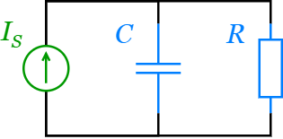

# Getting Started
This example runs through the basic steps of building and simulating a bond graph model. For a full list of functions refer to the API [Reference](@ref).

## Simple electric circuit

```@setup simple_circuit
using BondGraphs
```

Our first example will be a simple electric circuit of a capacitor, resistor, and current supply in parallel. We will first model this circuit without the current supply.



## Bond graph construction
We first create a `BondGraph` object which will hold all our components. This is an empty object that will soon be populated with components and bonds.

```@example simple_circuit
model = BondGraph("RC Circuit")
```

Next we will create a capacitor as a bond graph 'C'-component. The component type's `description` can be printed for extra information.

```@example simple_circuit
C = Component(:C)
description(:C)
```

Available component types are defined in the `DEFAULT_LIBRARY`.

```@example simple_circuit
keys(BondGraphs.DEFAULT_LIBRARY)
```

We next create a resistor 'R'-component and an `EqualEffort` node which represents Kirchoff's Voltage Law.

```@example simple_circuit
R = Component(:R)
kvl = EqualEffort()
```

Components and nodes are added to the model, and connected together as a graph network. Note that components must first be added to the model before they can be connected.

```@example simple_circuit
add_node!(model, [C, R, kvl])
connect!(model, R, kvl)
connect!(model, C, kvl)
model
```

Because our bond graph is fundamentally a graph, we can using existing graph methods on our model.

```@example simple_circuit
using Graphs
adjacency_matrix(model)
```

We can also visualise our model structure by plotting it as a graph network using Plots.jl.

```@example simple_circuit
using Plots
plot(model)
```

## Simulating our model
With a bond graph we can automatically generate a series of differential equations which combine all the constitutive relations from the components, with efforts and flows shared according to the graph structure.

```@example simple_circuit
constitutive_relations(model)
display("text/latex", ans); nothing # hide
```

We will set values for the component parameters in the model. Each component comes with default values. When substituted into our equations, we get the following relation for the capacitor charge `C.q(t)`.

```@example simple_circuit
C.C = 1
R.R = 2
constitutive_relations(model; sub_defaults=true)
display("text/latex", ans); nothing # hide
```

We can solve this bond graph directly using the in-built `simulate` function.

```@example simple_circuit
tspan = (0., 10.)
u0 = [1] # initial value for C.q(t)
sol = simulate(model, tspan; u0)
plot(sol)
```

Under the hood, our `simulate` function is converting our bond graph into an `ModelingToolkit.ODESystem`. We can chose instead to create an `ODESystem` directly and handle it with whatever functions we like.

## Adding control variables
We will expand our model by adding an external current (flow) supply in parallel, represented by the component `Sf` (Source of Flow)

```@example simple_circuit
Is = Component(:Sf, "Is")
add_node!(model, Is)
connect!(model, Is, kvl)
plot(model)
```

We will add a the forcing function `fs(t) = sin(2t)` as an external current input.

```@example simple_circuit
Is.fs = t -> sin(2t)
constitutive_relations(model; sub_defaults=true)
```

```@example simple_circuit
sol = simulate(model, tspan; u0)
plot(sol)
```

The input can be any arbitrary julia function of t, so long as it returns a sensible output. Note that for this to work you must register the custom function with `@register_symbolic`, so that the library knows not to simplify this function further.

```@example simple_circuit
using ModelingToolkit
@register_symbolic f(t)
Is.fs = t -> f(t)

f(t) = t % 2 <= 1 ? 0 : 1 # repeating square wave
sol = simulate(model, tspan; u0)
plot(sol)
```
